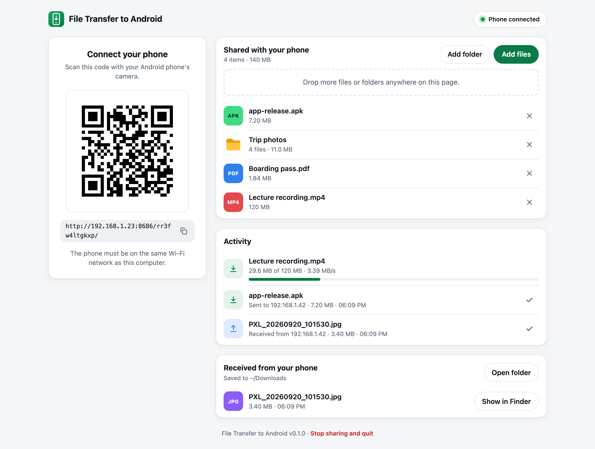
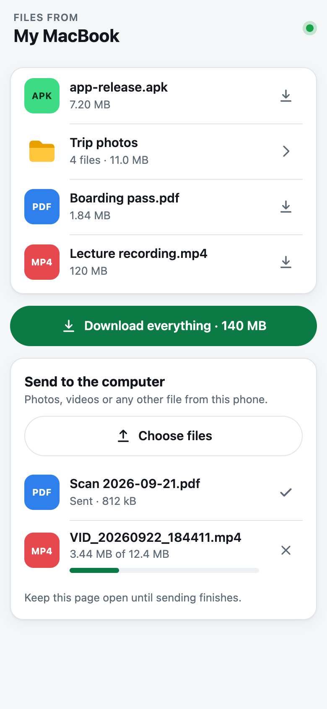

# File Transfer to Android

Send files from your computer to an Android phone over Wi-Fi, and back again.
Run it, scan the QR code with the phone's camera, and tap to download. Nothing
to install on the phone, no cable, no account, no cloud.

<p align="center">
  
  &nbsp;
  
</p>

## Features

- **Any Android phone, no app.** The phone uses its browser; downloads land in
  its Downloads folder. APKs download with the right type, so Android offers to
  install them.
- **Drag and drop.** Drop files or whole folders on the page on your computer,
  or pass them on the command line. The phone's list updates by itself.
- **Folders.** Browse into shared folders on the phone, download single files,
  or take a folder (or everything) as one ZIP, streamed without a temporary
  file.
- **Phone to computer.** Send photos and other files from the phone. They are
  saved to `~/Downloads` with their original dates, and never overwrite
  anything.
- **Live progress.** The computer shows each transfer as it happens, including
  resumed downloads.
- **Private by default.** The phone link carries a random code that changes
  every run, and the management page only answers your own computer. See
  [Security](#security).
- **One small binary** for macOS, Linux and Windows, with no runtime
  dependencies.

## Install

Download the binary for your computer from the
[latest release](https://github.com/ctbot000/file-transfer-to-android/releases/latest):

| Computer | File |
| --- | --- |
| Mac with Apple silicon | `file-transfer-to-android_darwin_arm64.tar.gz` |
| Mac with Intel | `file-transfer-to-android_darwin_amd64.tar.gz` |
| Linux | `file-transfer-to-android_linux_amd64.tar.gz` (or `_arm64`) |
| Windows | `file-transfer-to-android_windows_amd64.zip` (or `_arm64`) |

On a Mac with Apple silicon, for example:

```bash
curl -fsSL "https://github.com/ctbot000/file-transfer-to-android/releases/latest/download/file-transfer-to-android_darwin_arm64.tar.gz" | tar -xz
```

That creates a `file-transfer-to-android_darwin_arm64` folder. Run the app
from there, or move `file-transfer-to-android` into a folder on your `PATH`,
such as `/usr/local/bin`.

Downloading with `curl` avoids macOS's quarantine check. If you download the
archive in a browser instead, macOS refuses to run the binary, which is not
signed by a registered developer, until you clear the flag once:

```bash
xattr -dr com.apple.quarantine file-transfer-to-android_darwin_arm64
```

On Windows, unzip the archive and run `file-transfer-to-android.exe`.

With Go 1.25 or later you can also install from source:

```bash
go install github.com/ctbot000/file-transfer-to-android@latest
```

## Use

```bash
file-transfer-to-android
```

This prints a QR code in the terminal and opens a page in your browser with the
same code. Then:

1. Make sure the phone is on the same Wi-Fi network as the computer.
2. Scan the QR code with the phone's camera app, and open the link.
3. Tap a file to download it, or **Download everything** for one ZIP.
   **Send to the computer** goes the other way.

To add files, drop them on the page on your computer, use **Add files** or
**Add folder**, or name them on the command line:

```bash
file-transfer-to-android "Boarding pass.pdf" ~/Pictures/Trip
```

Running the command again while it is open adds the files to the session
that is already running, instead of starting another one. Stop with Ctrl+C in
the terminal, or **Stop sharing and quit** at the bottom of the page.

### Options

| Option | Meaning |
| --- | --- |
| `-port 8686` | Port to listen on. If 8686 is taken and you did not ask for it, any free port is used. |
| `-receive-dir folder` | Where files sent from the phone are saved. Default `~/Downloads`. |
| `-no-receive` | Do not let the phone send files to this computer. |
| `-name "My Laptop"` | Computer name shown on the phone. Default: this computer's name. |
| `-host address` | Address to put in the phone link, instead of the detected one. |
| `-no-browser` | Do not open the page on the computer. |
| `-version` | Print the version. |

## Security

- **The phone link is the key.** It contains a random 60-bit code, and without
  it the app serves nothing but a "not found" page. A new code is made every
  time the app starts, so old links stop working.
- **The management page stays on your computer.** It and its API only answer
  requests that come over loopback and name `localhost` (which defeats DNS
  rebinding), and they need a second, 130-bit key that other web sites cannot
  read or send.
- **Only what you share is reachable.** Shared folders are served through Go's
  `os.Root`, so `..` and symbolic links cannot reach outside them. Hidden
  files such as `.DS_Store` are left out.
- **Received files never overwrite anything.** Names from the phone are
  cleaned up, a number is added if the name is taken, and a file only gets its
  real name once it has fully arrived.
- **The connection is not encrypted.** It is plain HTTP on your local network,
  like most tools of this kind, because phones do not trust self-signed
  certificates. Someone who can watch the traffic on the same network could see
  the files. Use it on networks you trust, such as your home Wi-Fi or your
  phone's hotspot.

## Troubleshooting

**The page does not load on the phone.** Check that both are on the same
network. Guest and public Wi-Fi networks often keep devices from reaching each
other; a VPN on either device can do the same. If the computer has several
network connections, the page on the computer offers the other addresses under
**Not loading on the phone?** On a Mac, allow incoming connections if the
firewall asks. As a fallback, connect the computer to the phone's hotspot.

**Where are the downloads on the phone?** In the Downloads folder: open the
Files app and choose Downloads. ZIP files can be extracted there.

**Installing an APK.** Android asks you to allow installs from the browser
the first time. That is Android's own safety check.

**The link says it has expired.** The app was restarted. Scan the new QR code.

## How it works

The app is a small HTTP server. The QR code holds a URL such as
`http://192.168.1.23:8686/k7x2m9qfp3ab/`: this computer's address on the local
network and the secret code. The phone opens it in its browser and gets a page
that lists the shared files and downloads them straight from the server, with
`Range` support for resuming. Files named on the command line are served from
where they are. Files dropped on the page are copied to a temporary folder
first, because browsers never reveal where a dropped file lives; the copies are
deleted when the app quits. Both pages follow changes through server-sent
events.

```text
main.go             command line, terminal QR code, hand-off to a running session
internal/server     HTTP handlers: phone page, desktop page, ZIP streaming, uploads
internal/qrcode     QR encoding with mask selection; SVG and terminal rendering
internal/netaddr    picks the address a phone on the same Wi-Fi can reach
web/                the two pages, embedded in the binary; no build step
```

To build and test:

```bash
go test ./...
```

```bash
go build .
```

## License

[MIT](LICENSE). The binaries include code under the BSD licenses listed in
[THIRD_PARTY_LICENSES.txt](THIRD_PARTY_LICENSES.txt).
